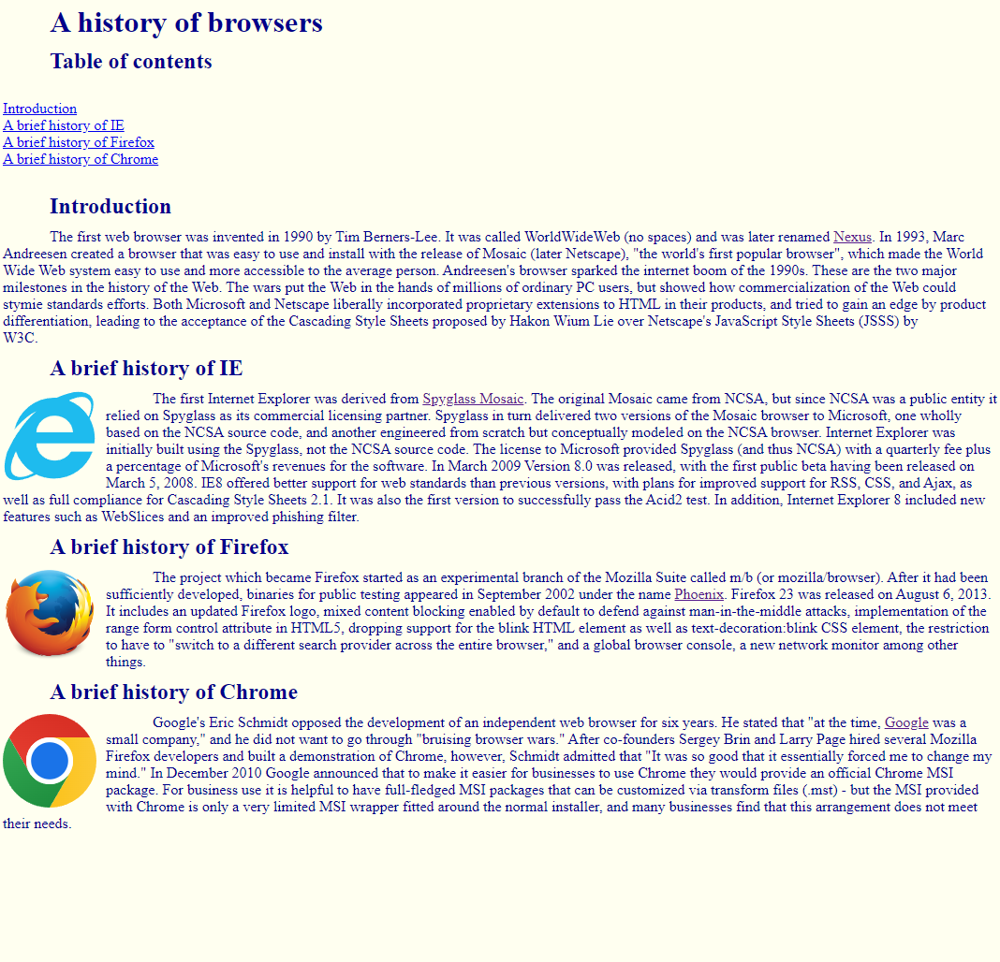
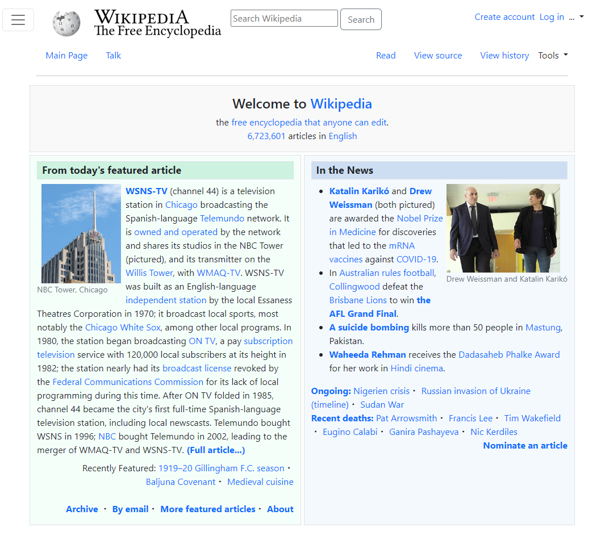

I've never had much experience in creating websites. Recently I started learning a little HTML and CSS in order to create some basic websites. Very basic websites, in fact. Mostly just text formatted on a webpage with some images and hyperlinks to different areas of the page, or to separate pages. Eventually from there, I went on to try Bootstrap 5.

*An example of a basic webpage I created using just HTML and CSS*

## Bootstrap 5

Bootstrap 5 is a UI framework that was mostly intended for use in mobile devices. It adds features that make it easier to format a webpage. Some of the features include adding a navbar, which makes it easy to add buttons at the top of the screen to navigate pages, and a grid system, which makes it easier to create a webpage with many rows and columns. This makes it easier to create a website has locations where you can put buttons that the website may need, or places to put text, while still looking appealing.

*A Wikipedia mockup I created using Bootstrap 5*

## My thoughts on Boostrap 5

Personally, I feel that Bootstrap 5 is a very powerful tool. I don't have any experience using other UI frameworks, and only just started learning about CSS and HTML. I think that Bootstrap 5 has a lot of features that are helpful such as adding the navigation bars and buttons for navigation. I also think that the grid system is helpful to align the elements on the webpage. If you want to make a website, Bootstrap 5 can be a great starting point. Something I think may be an issue is if the layout you want to create is not easily created by Bootstrap, you may have a lot of trouble trying to create it. There may be other UI frameworks for that situation. I have not used Bootstrap 5 for that long, so it could just be speculation, and Bootstrap 5 may be able to create any layout you want.

