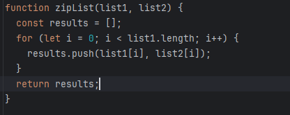

The idea behind coding standards makes sense to me. You want to make sure that code is readable and easily understood at a glance.  Some of the things that are required from these coding standards are not really my cup of tea. But what really is a coding standard?

## Coding Standards

A coding standard is a standard in the way in which you write code. It tells you the proper way to format the code in ways such as the number of spaces that you are expected to use, and the spacing between brackets and characters. It tells you when you should use a new line. In this way, you will create a program that is easily read. When two people would be to write the same code using the same functions, then their code should look exactly the same.

*An example of code following a coding standard*

## My Issues with Coding Standards

Maybe this is just me, as I have not worked on a major coding project where I have had to read over many different people’s types of code, but I think that coding standards aren’t that necessary. To me, it just feels like it inhibits people’s freedom to code in a certain way or style that they want. To me, it feels like as long as the code isn’t completely messy where they tried to write everything in a single line, it should be fine. I also think that these coding standards could be automatically formatted if it really mattered that much, instead of forcing someone to write their code, the code would change automatically at the end.

## Conclusions

Overall, I just feel like coding standards are just a tedious thing that you need to add and follow for yourself. For one coding standard that I had to use, ESLint, they are even having you format your comments a certain way, which to me feels super unnecessary. Maybe in the future I will change my mind, but right now, it just feels tedious and unnecessary to me.
