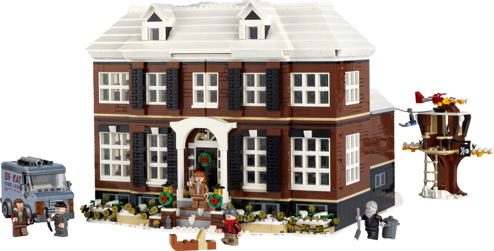

## Introduction

Imagine giving someone a pile of Legos, and asking them to build a house. Many people would build a house, and many of them look different, yet they can be identified as a house. Many of them even will end up having similar features. Many people will build a house, and they will have different features, but they will have mostly the same functionality, and there will be some features that are better than others. This is the idea behind design patterns.

    

## Design Patterns
Design patterns are exactly what it sounds like. They are patterns that occur in the design process. They are not necessarily a specific design, but rather a general idea of how to design something. They are not necessarily a specific design, but rather a general idea of how to design something. There are design patterns like Singleton, MVC, Observer, and many more, but they are not specific examples of the code. It is more of the way that the code is laid out and interacts with each other. The main example I can give is the Factory design pattern. In this design pattern, you have an initial class that can be changed to develop other classes, such as a shape factory generating individual shapes. In this Lego analogy, this could be like a kit for home that has different accessories that can be added on to the house. The house is the initial class, and the accessories are the other classes that can be made from the base house. 

## How Have I used Design Patterns?

In my experience writing code, I have never deliberately went out and looked for a design pattern to execute my code on. When I am asked to code something, I don't think about it in terms of design patterns and In the Lego analogy, I am just placing Legos until it resembles a house. The code is functional, and in that way, resembles some design patterns, but I did not intentionally design my code around those patterns. The main design pattern that I have used without being aware of it is the observer design pattern, where there is an object that maintains the data, and an observer that observes the data from the maintainer. Now that I am aware of these design patterns, I can be more aware in looking for applicable opportunities to use them. Since design patters occur from experience from others, I think that I can learn from others and use that experience to help me in my own coding.