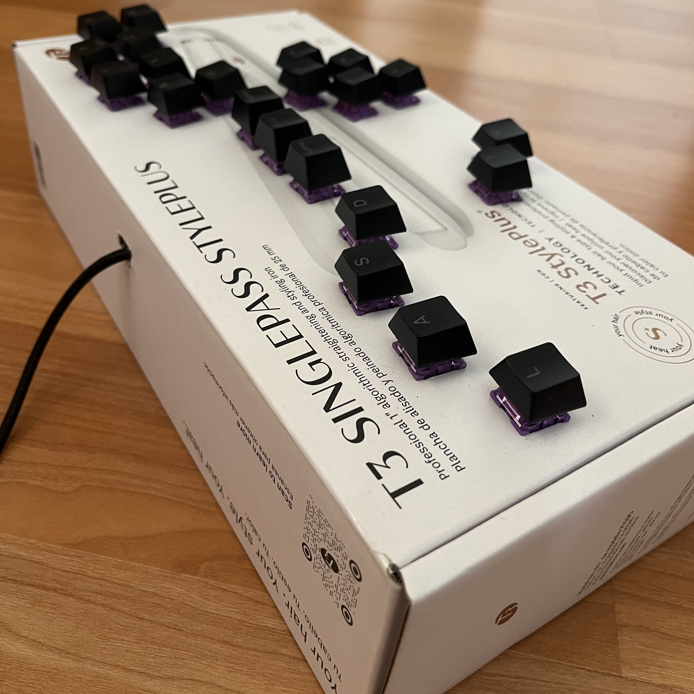
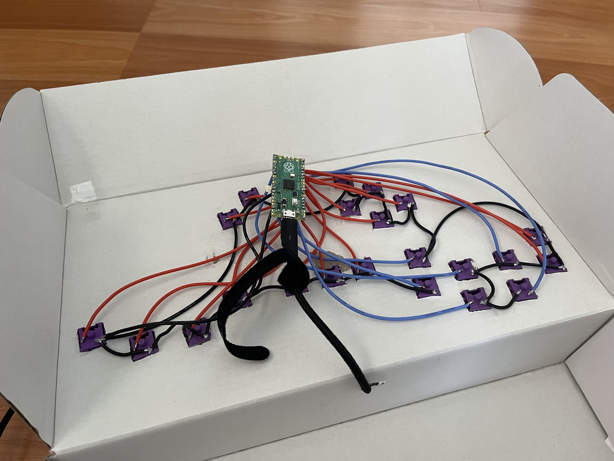

  
  

Button controllers have become a popular way to enjoy playing games such as fighting games. Companies like HitBox have inspired many other companies to start create similar controllers. Now the market is filled with several of these button controllers. Even companies like Razer have created a button controller. I play some games where using an all button controller would make sense, so I decided to try make one for myself.

In order to create an all button controller, I used a Rasberry Pi Pico, keyboard switches and keycaps, a cardboard box, and wires and solder to connect the switches to the Pico. I cut holes into the cardboard box the size of the keyboard switch to the desired layout. I then put the switches into the cutout and then started soldering the wires to the Pico. Once I finished soldering, I flashed the Pico with some open source firmware to have it function as a controller whe plugged in. 

This project was my first experience soldering, and I learned to solder through this experience. This was specifically a project for me to get familiar with wiring and soldering things together that I would use. Maybe in the future I will try to write my own firmware for the Pico and turn this project into a whole experience, rather than just a hardware one.
