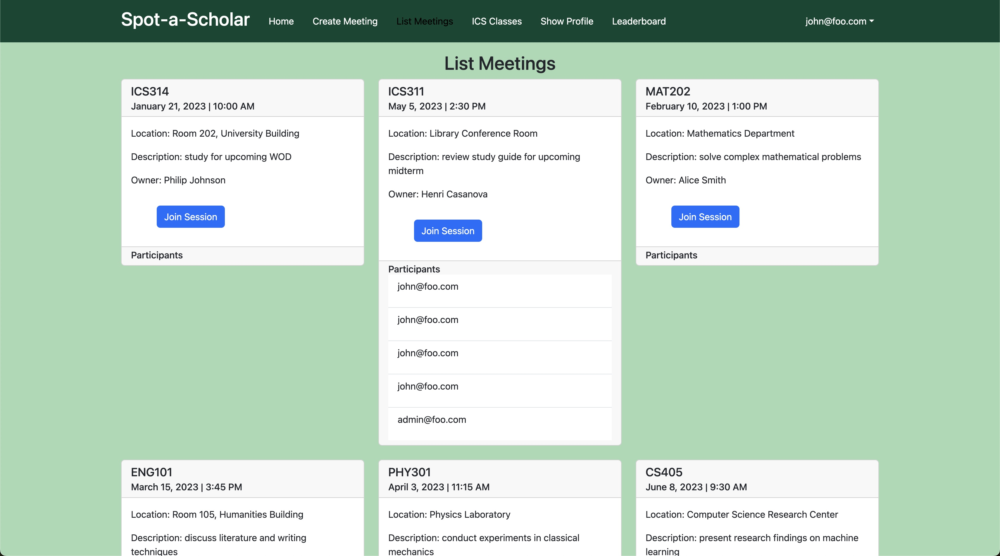

Spot-A-Scholar was a web application developed for ICS 314. It was a web application intended for the use of creating study sessions. It uses Meteor and Uniforms to allow for users to send information into a collection. There are three main collections for our web application. We have a collection of users, one for the meetings, and another one for the participants of the meeting. This project was done as a team of 5.

The things that I was responsible for in this project was creating the collection of users. That means I was responsible for the create user profile page, the show user profile page, and the edit user profile page. I also created the create meeting page, and a basic meeting schema for the meeting collection, that was later changed. I was also mainly responsible for deploying the web application to digital ocean.

This project taught me to work in a team, as we delegated tasks to different people. It allowed me to use Meteor and Uniforms to create a web application, and use collections from MongoDB to store data. It allowed me to use some of the things I learned, and apply it to a practical application. It helped me use GitHub to collaborate with others on a project in a more efficient way, as we were all working on the same files.

This is an image of the web application. This shows the list of meetings that are planned on the Spot-A-Scholar web application.

  

Learn more about how to use Spot-A-Scholar [here](https://spot-a-scholar.github.io/).

You can find the source code [here](https://github.com/spot-a-scholar).
